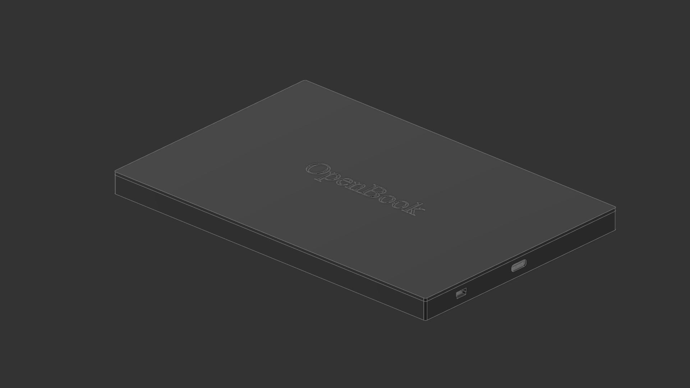
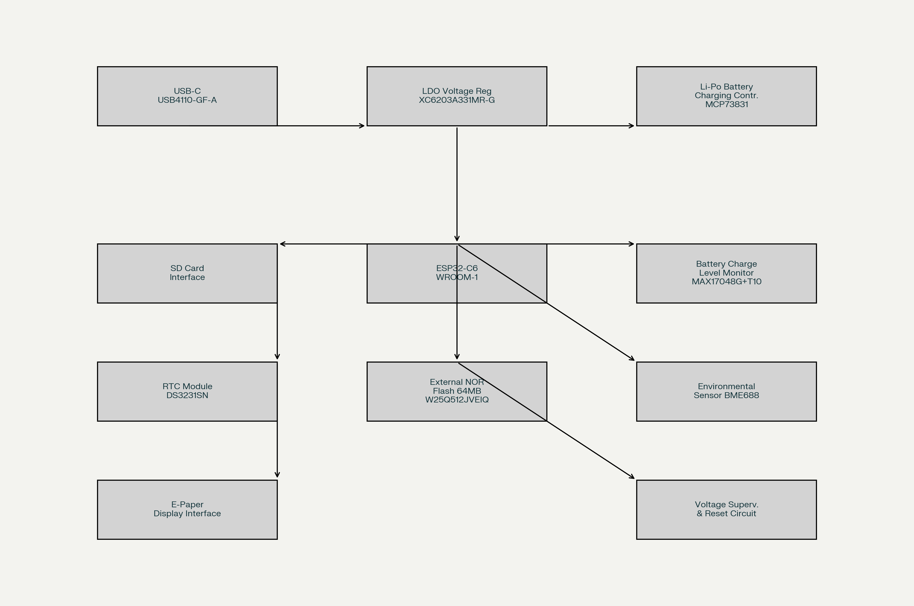
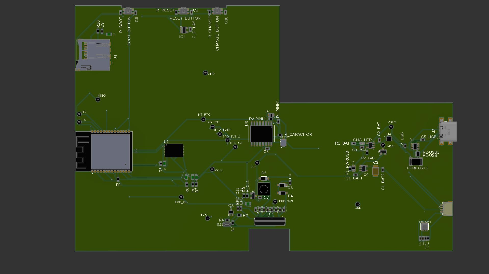

# eBook reader - Pacuraru Mihai Dorin

This product is an eBook reader that uses an **ESP32-C6** microcontroller powered by an **USB Type-C**.

 Implementation steps:
    - create 2D schematic
    - create 2D PCB, solving routing errors
    - add 3D model to every component 
    - pushed 2D PCB to 3D
    - created 3D model for battery
    - imported display model
    - build the final 3D model of product

---

## Block Diagram

---

## Hardware functionalities

### ESP32-C6 microcontroller

The ESP32-C6 microcontroller has a single core SoC RISC-V that supports:
  - WiFi6, Bluetooth 5, Zigbee and Thread
  - integrated flash memory up to 8 MB
  - 23 GPIO pins
  - SPI, 12C, UART, I2S, USB interfaces support

Charging and energy management:
  - USB-C that uses USB4110-GF-A connector with ESD protection for battery charging
  - LiPo battery that gets charged with the help of MCP73831 controller
  - the integrated circuit MAX17048G+T10 for monitorizing battery charging level via I2C interface

Display system:
  - E-Paper driver interface connected to microcontroller via SPI

Memory:
  - microSD card interface connected via SPI for heavy data

### ESP32-C6 pins configuration
| Component | PIN |
|----|----|
|Display SPI | MOSI, CLK, CS, DC |
|BME688 | SDA, SCL, I2C |
|Buttons | GPIO1, GPIO2, GPIO3 |
|USB-C | D+, D-, VBUS |

---
## Bill of Materials (BOM)
| Component | Buy | Datasheet |
| ---------- | --------- | --------- |
| PFMF.050.1 | [Retailer](https://ro.mouser.com/ProductDetail/Schurter/PFMF.050.2?qs=1auRipcfynCums5v1iucSA%3D%3D) |  [Datasheet](https://ro.mouser.com/datasheet/2/358/typ_PFMF-1275918.pdf) |
| USB4110-GF-A | [Retailer](https://ro.mouser.com/ProductDetail/GCT/USB4110-GF-A?qs=KUoIvG%2F9IlYiZvIXQjyJeA%3D%3D) | [Datasheet](https://ro.mouser.com/datasheet/2/837/GCT_USB4110_Product_Drawing___20k_cycles-3455479.pdf) |
| USBLC6-2SC6Y | [Retailer](https://ro.mouser.com/ProductDetail/STMicroelectronics/USBLC6-2SC6Y?qs=gNDSiZmRJS%2FOgDexvXkdow%3D%3D) | [Datasheet](https://ro.mouser.com/datasheet/2/389/usblc6_2sc6y-1852505.pdf) |
| SD0805S020S1R0 | [Retailer](https://ro.mouser.com/ProductDetail/KYOCERA-AVX/SD0805S020S1R0?qs=jCA%252BPfw4LHbpkAoSnwrdjw%3D%3D) | [Datasheet](https://ro.mouser.com/datasheet/2/40/schottky-3165252.pdf) |
| DMG2305UX-7 | [Retailer](https://ro.mouser.com/ProductDetail/Diodes-Incorporated/DMG2305UX-7?qs=L1DZKBg7t5F%2FNBHrjfxC%252Bg%3D%3D) | [Datasheet](https://www.diodes.com/assets/Datasheets/DMG2305UX.pdf) |
| XC6220A331MR-G | [Retailer](https://ro.mouser.com/ProductDetail/Torex-Semiconductor/XC6220A331MR-G?qs=AsjdqWjXhJ8ZSWznL1J0gg%3D%3D) | [Datasheet](https://ro.mouser.com/datasheet/2/760/xc6220-3371556.pdf) |
| Condensator 100 uF TANT | [Retailer](https://ro.mouser.com/ProductDetail/KYOCERA-AVX/TAJW107M010RNJ?qs=Wtp%252Bf%2FAeVqIH8v1VxV%252B1Rg%3D%3D) | [Datasheet](https://ro.mouser.com/datasheet/2/40/TAJ-3165264.pdf) |
| 112A-TAAR-R03_ATTEND | [Retailer](https://www.digikey.ro/en/products/detail/attend-technology/112A-TAAR-R03/17633923) | [Datasheet](https://www.attend.com.tw/data/download/file/112A-TAAR-R03_Spec.pdf)
| ESP32-C6-WROOM-1-N8 | [Retailer](https://ro.mouser.com/ProductDetail/Espressif-Systems/ESP32-C6-WROOM-1-N8?qs=8Wlm6%252BaMh8ST02Gmwp74cw%3D%3D) | [Datasheet](https://ro.mouser.com/datasheet/2/891/Espressif_ESP32_C6_WROOM_1__Datasheet_V0_1_PRELIMI-3239987.pdf) |
| MCP73831 | [Retailer](https://ro.mouser.com/ProductDetail/Microchip-Technology/MCP73831T-2ACI-OT?qs=yUQqVecv4qvbBQBGbHx0Mw%3D%3D) | [Datasheet](https://ro.mouser.com/datasheet/2/268/MCP73831_Family_Data_Sheet_DS20001984H-3441711.pdf) |
| CHG_LED | [Retailer](https://store.comet.srl.ro/Catalogue/Product/40478/) | [Datasheet](https://www.snapeda.com/parts/KP-1608SURCK/Kingbright/datasheet/) |
| SI1308EDL-T1-GE3 | [Retailer](https://ro.mouser.com/ProductDetail/Vishay-Semiconductors/SI1308EDL-T1-GE3?qs=bX1%252BNvsK%2FBramh9tgpOaEw%3D%3D) | [Datasheet](https://www.vishay.com/doc?63399) |
| MBR0530 | [Retailer](https://ro.mouser.com/ProductDetail/Micro-Commercial-Components-MCC/MBR0530-T?qs=9VyI4qLX4NTSXkb9ynzJnA%3D%3D) | [Datasheet](https://ro.mouser.com/datasheet/2/258/mcc_mbr0520~mbr0560sod123-1179695.pdf) |
| L1 | [Retailer](https://ro.mouser.com/ProductDetail/Wurth-Elektronik/744043680?qs=PGXP4M47uW6VkZq%252BkzjrHA%3D%3D) | [Datasheet](https://www.we-online.com/components/products/datasheet/744043680.pdf) |
| FH34SRJ-24S-0.5SH_99_ | [Retailer](https://ro.mouser.com/ProductDetail/Hirose-Connector/FH34SRJ-24S-0.5SH99?qs=vcbW%252B4%252BSTIpKBl5ap9J8Fw%3D%3D) | [Datasheet](https://ro.mouser.com/datasheet/2/185/FH34SRJ_24S_0_5SH_99__CL0580_1255_6_99_2DDrawing_0-1615044.pdf) |
| BME688 | [Retailer](https://ro.mouser.com/ProductDetail/Bosch-Sensortec/BME688?qs=IS%252B4QmGtzzqQoVDscqwx3A%3D%3D) | [Datasheet](https://ro.mouser.com/datasheet/2/783/bst_bme688_fl000-2307034.pdf) |
| BD5229G-TR | [Retailer](https://ro.mouser.com/ProductDetail/ROHM-Semiconductor/BD5229G-TR?qs=4kLU8WoGk0vvnhrrYwdszw%3D%3D) | [Datasheet](https://fscdn.rohm.com/en/products/databook/datasheet/ic/power/voltage_detector/bd52xxg-e.pdf) |
| Button | [Retailer](https://ro.mouser.com/ProductDetail/CK/KMR221GULCLFS?qs=u2NJ%252B70r0goBXaNk7IrU0Q%3D%3D) | [Datasheet](https://www.ckswitches.com/media/1479/kmr2.pdf) |
| MAX17048G+T10 | [Retailer](https://ro.mouser.com/ProductDetail/Analog-Devices-Maxim-Integrated/MAX17048G%2bT10?qs=D7PJwyCwLAoGnnn8jEPRBQ%3D%3D) | [Datasheet](https://ro.mouser.com/datasheet/2/609/MAX17048_MAX17049-3469099.pdf) |
| W25Q512JVEIQ | [Retailer](https://ro.mouser.com/ProductDetail/Winbond/W25Q512JVEIQ?qs=l7cgNqFNU1jw6svr3at6tA%3D%3D) | [Datasheet](https://ro.mouser.com/datasheet/2/949/Winbond_W25Q512JV_Datasheet-3240039.pdf) |
| PGB1010603MR | [Retailer](https://ro.mouser.com/ProductDetail/Littelfuse/PGB1010603MRHF?qs=KvZd0dN2Zg%2FuIq6icj%252BGKA%3D%3D) | [Datasheet](https://www.littelfuse.com/media?resourcetype=datasheets&itemid=8a337998-d54d-466b-be4e-dc5bcd1f9321&filename=littelfuse_pulseguard_pgb1_datasheet.pdf) |
| QWIIC_RIGHT_ANGLE | [Retailer](https://ro.mouser.com/ProductDetail/GCT/USB4110-GF-A?qs=KUoIvG%2F9IlYiZvIXQjyJeA%3D%3D) | [Datasheet](https://ro.mouser.com/datasheet/2/837/GCT_USB4110_Product_Drawing___20k_cycles-3455479.pdf) |
| DS3231SN# | [Retailer](https://ro.mouser.com/ProductDetail/Analog-Devices-Maxim-Integrated/DS3231SN?qs=ffX8NcjNb2RmKAb9wAk9Ug%3D%3D) | [Datasheet](https://ro.mouser.com/datasheet/2/609/DS3231-3421123.pdf) |
| CPH3225A C10_SUPERCAP | [Retailer](https://ro.mouser.com/ProductDetail/Seiko-Semiconductors/CPH3225A?qs=3etwrb1wR%252BhUOph6lAO7eg%3D%3D) | [Datasheet](https://ro.mouser.com/datasheet/2/360/Seiko_Instruments_MicroBattery_E_20230330_2024Jan_-3561061.pdf) |
| Condensator 100nF | [Retailer](https://ro.mouser.com/ProductDetail/KYOCERA-AVX/06033G104ZAT2A?qs=NXubJDmysXJMPmHfVo6Z%252BA%3D%3D) | [Datasheet](https://ro.mouser.com/datasheet/2/40/KGM_Y5V-3223189.pdf) |
| Condensator 4.7uF | [Retailer](https://ro.mouser.com/ProductDetail/KYOCERA-AVX/0402ZD475MAT2A?qs=NBFAU1oqP4W4U2PCPHI0sg%3D%3D) | [Datasheet](https://ro.mouser.com/datasheet/2/40/cx5r_KGM-3223198.pdf) |
| Condensator 10uF | [Retailer](https://ro.mouser.com/ProductDetail/Samsung-Electro-Mechanics/CL10A106KQ8NNNL?qs=xZ%2FP%252Ba9zWqaes9JKSsob2Q%3D%3D) | [Datasheet](https://ro.mouser.com/datasheet/2/585/MLCC-1837944.pdf) |
| Condensator 1uF/50V | [Retailer](https://ro.mouser.com/ProductDetail/KYOCERA-AVX/06035D105MAT2A?qs=k4kUdCzLgS5%252BURKe1SOIeQ%3D%3D) | [Datasheet](https://ro.mouser.com/datasheet/2/40/cx5r_KGM-3223198.pdf) |
| Resistor 10K | [Retailer](https://ro.mouser.com/ProductDetail/Vishay-Beyschlag/MCS0402MD1002BE000?qs=17u8i%2FzlE8%2F9BrAaXkMk1w%3D%3D) | [Datasheet](https://www.vishay.com/doc?28952) |
| Resistor 200 | [Retailer](https://ro.mouser.com/ProductDetail/Vishay-Beyschlag/MCS0402MD2000BE100?qs=3SvaY9RawMJNVte4F12%252BZQ%3D%3D) | [Datasheet](https://www.vishay.com/doc?28952) |
| Resistor 100K | [Retailer](https://ro.mouser.com/ProductDetail/Vishay-Beyschlag/MCT0603PD1003DP500?qs=5aG0NVq1C4wWAn8Ei3OpZA%3D%3D) | [Datasheet](https://www.vishay.com/doc?28916) |
| Resistor 2.2 | [Retailer](https://ro.mouser.com/ProductDetail/SEI-Stackpole/RMCF0402FT2R20?qs=IPgv5n7u5QbBgyl0jwhwsA%3D%3D) | [Datasheet](https://ro.mouser.com/datasheet/2/385/SEI_RMCF_RMCP-3077565.pdf) |
| Resistor 5K1| [Retailer](https://www.venkel.com/part/TFCR0603-16W-K-5690FT) | [Datasheet](https://data.venkel.com/documents/tfcr-series?_gl=1*tdo8m*_ga*NTA1MTc5MTcyLjE3NDM4OTMzNjc.*_ga_JRKGBZNVM8*MTc0Mzg5MzM2Ni4xLjAuMTc0Mzg5MzM2OC41OC4wLjA.) |
| Resistor 2K | [Retailer](https://ro.mouser.com/ProductDetail/Vishay-Beyschlag/MCS04020C2001FE000?qs=wTZ%2FFzl837YG0wIkZJJOwQ%3D%3D) | [Datasheet](https://www.vishay.com/doc?28705) |
| Resistor 0.47 | [Retailer](https://ro.mouser.com/ProductDetail/SEI-Stackpole/CSR0402JKR470?qs=IPgv5n7u5QawIB6nBEt8wA%3D%3D) | [Datasheet](https://ro.mouser.com/datasheet/2/385/SEI_CSR_CSRN-3077593.pdf) |
| Resistor 15 | [Retailer](https://ro.mouser.com/ProductDetail/YAGEO/RT0402FRE0715RL?qs=BXCcY9r%252B08DFFpLSkPOIqQ%3D%3D) | [Datasheet](https://ro.mouser.com/datasheet/2/447/PYu_RT_1_to_0_01_RoHS_L_15-3461507.pdf) |
